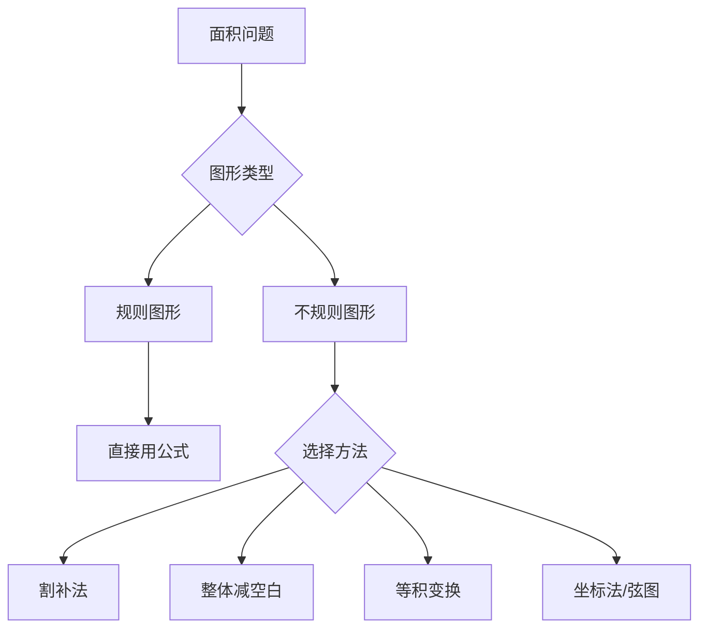

---
tags:
  - 奥数
  - 几何
  - 面积
lecture: 1
topic: 方田探秘
---

# 第1讲 方田探秘

## 核心知识点

### 1. 对角线互相垂直的四边形面积

> [!tip] 公式
> 面积 = 对角线1 × 对角线2 ÷ 2

适用于：菱形、正方形、以及任何对角线互相垂直的四边形。

### 2. 田字格模型

当一个大长方形被分成若干小长方形时，利用**等高等宽**关系建立面积等式。

> [!example] 典型题
> 大长方形被分成4个小长方形，已知其中3个面积，求第4个。
> 利用关系：$S_1 \times S_4 = S_2 \times S_3$（对角位置乘积相等）

### 3. 整体减空白法

> [!tip] 方法
> 目标面积 = 大图形面积 − 空白部分面积

常用于求阴影面积、不规则图形面积。

### 4. 勾股定理的面积应用（弦图）

用四个相同直角三角形（直角边 $a$、$b$）拼成正方形：
- 外正方形面积：$(a+b)^2$
- 中间白色正方形面积：$a^2 + b^2 - 2ab = (a-b)^2$
- 白色正方形边长：$\sqrt{a^2 + b^2}$（即斜边长）

### 5. 割补法

将不规则图形通过**切割**或**补全**转化为规则图形来计算面积。

常见技巧：
- 补成长方形/正方形，再减去多余部分
- 沿对称轴翻折
- 平移拼合

### 6. 等积变换

> [!tip] 核心思想
> 同底等高的三角形面积相等

应用：
- 在同一底边上移动顶点（保持高不变），面积不变
- 两个长方形内的对角三角形面积相等

### 7. 长方形剪切问题

从长方形中剪去一个小长方形：
- **面积**：无论怎么剪，剩余面积 = 大面积 − 小面积（不变）
- **周长**：取决于剪切位置
  - 从边上剪：周长增加 2 × 短边
  - 从角上剪：周长不变
  - 从中间剪：周长增加 2 ×（长 + 宽）

### 8. 环形面积（框形面积）

> [!tip] 公式
> 环形面积 = 外面积 − 内面积

四周环绕道路问题：
- 大长方形长 = 原长 + 2×路宽
- 大长方形宽 = 原宽 + 2×路宽

## 解题策略

## 易错点

> [!warning] 注意
> - 面积单位是"平方厘米"，周长单位是"厘米"，不要混淆
> - 对角线互相垂直 ≠ 对角线相等
> - 剪切问题中，面积不变但周长可能变化

## 相关链接

- [[小测 第1讲 方田探秘]] — 课后小测题目
- [[加油站 第1讲 方田探秘]] — 加油站练习
- [[错题 第1讲 方田探秘]] — 错题记录
- [[第5讲 几何计数进阶]]
