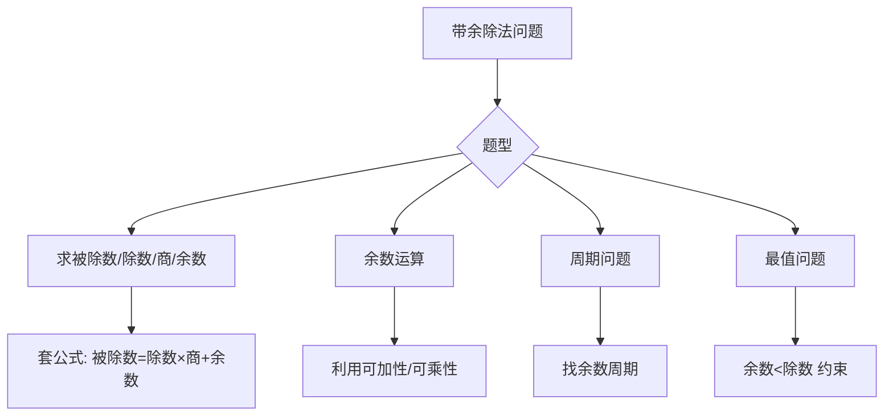

---
tags:
  - 奥数
  - 数论
  - 带余除法
lecture: 2
topic: 年年有余
---

# 第2讲 年年有余（带余除法）

## 核心知识点

### 1. 带余除法基本关系

> [!tip] 核心公式
> **被除数 = 除数 × 商 + 余数**（其中 0 ≤ 余数 < 除数）

逆向应用：
- 已知除数、商、余数 → 被除数 = 除数 × 商 + 余数
- 已知被除数、除数 → 商 = 被除数 ÷ 除数（取整），余数 = 被除数 − 除数 × 商

### 2. 余数的基本性质

> [!important] 关键约束
> **余数 < 除数**（余数最大为除数 − 1）

应用：
- 当商与余数相等时，设为 $q$，则被除数 = 除数 × $q$ + $q$ = $q$ ×（除数 + 1）
- 余数最大时取"除数 − 1"

### 3. 和差倍问题与除法结合

> [!example] 典型题型
> "被除数与除数的和为 N，商为 q，余数为 r"
> 
> 解法：被除数 = 除数 × q + r
> 被除数 + 除数 = 除数 ×（q + 1）+ r = N
> 除数 =（N − r）÷（q + 1）

### 4. 余数的运算性质

> [!tip] 余数的可加性
> $(a + b) \mod n = [(a \mod n) + (b \mod n)] \mod n$

> [!tip] 余数的可减性
> $(a - b) \mod n = [(a \mod n) - (b \mod n)] \mod n$
> 
> 注意：不够减时要借一个除数（加 n 再取余）

> [!tip] 余数的可乘性
> $(a \times b) \mod n = [(a \mod n) \times (b \mod n)] \mod n$

### 5. 余数的周期性

利用余数的可乘性，幂次的余数会呈现周期性变化。

> [!example] 方法
> 求 $a^k \mod n$：
> 1. 先算 $a, a^2, a^3, \ldots$ 除以 $n$ 的余数序列
> 2. 找到周期 $T$
> 3. 用 $k \mod T$ 确定答案

### 6. 斐波那契数列的余数周期

斐波那契数列（每个数 = 前两个数之和）除以任何数的余数都有周期性（皮萨诺周期）。

### 7. 星期问题

> [!tip] 方法
> 今天是星期 $x$，再过 $n$ 天是星期几？
> 答案 = $(x + n \mod 7)$，若结果为 0 则是星期日

### 8. 被除数/除数同时变化

- 被除数和除数**同时乘以** $k$：商不变，余数变为原来的 $k$ 倍
- 被除数和除数**同时除以** $k$：商不变，余数变为原来的 $\frac{1}{k}$

### 9. 反向求除数

> [!example] 典型题
> "除以一个数，余数为 r"→ 被除数 − r 是除数的倍数
> 
> 设被除数为 $a$，则除数是 $(a - r)$ 的因数，且除数 > $r$

## 解题策略

## 经典题型

### 商与余数相等

设商 = 余数 = $q$，则：
- 被除数 = 除数 × $q$ + $q$
- 约束：$q$ < 除数

### "好数"问题

一个正整数除以它的数码和后余数为特定值 → 枚举验证。

## 易错点

> [!warning] 注意
> - 余数必须**严格小于**除数，等于除数时商要加1
> - 余数相减不够减时，要**借一个除数**再减
> - "同时扩大/缩小"时余数也跟着变化，不是不变

## 相关链接

- [[第3讲 何时无余]]
