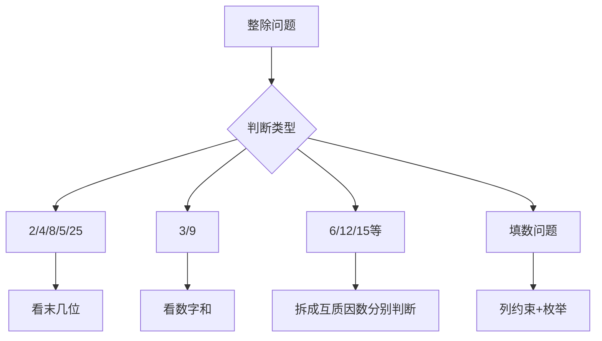

---
tags:
  - 奥数
  - 数论
  - 整除
lecture: 3
topic: 何时无余
---

# 第3讲 何时无余（整除特征）

## 核心知识点

### 1. 末位判定法

| 整除数 | 判定方法 |
|--------|----------|
| **2** | 末一位是 0、2、4、6、8（偶数） |
| **5** | 末一位是 0 或 5 |
| **4** | 末两位能被 4 整除 |
| **25** | 末两位能被 25 整除 |
| **8** | 末三位能被 8 整除 |
| **125** | 末三位能被 125 整除 |

> [!tip] 记忆规律
> 2、4、8 看末 1、2、3 位；5、25、125 看末 1、2、3 位。
> 本质：$10 = 2 \times 5$，所以 $2^n$ 和 $5^n$ 只与末 $n$ 位有关。

### 2. 数字和判定法

| 整除数 | 判定方法 |
|--------|----------|
| **3** | 各位数字之和能被 3 整除 |
| **9** | 各位数字之和能被 9 整除 |

> [!example] 示例
> 判断 2847 能否被 9 整除：2+8+4+7 = 21，21 ÷ 9 = 2…3，不能。
> 判断 2847 能否被 3 整除：21 ÷ 3 = 7，能。

### 3. 组合判定法

| 整除数 | 判定方法 |
|--------|----------|
| **6** | 同时能被 2 和 3 整除 |
| **12** | 同时能被 4 和 3 整除 |
| **15** | 同时能被 3 和 5 整除 |
| **18** | 同时能被 2 和 9 整除 |
| **36** | 同时能被 4 和 9 整除 |
| **45** | 同时能被 5 和 9 整除 |

> [!warning] 注意
> 组合判定要求两个因数**互质**。
> 例如：能被 4 和 6 整除 ≠ 能被 24 整除（因为 4 和 6 不互质）

### 4. 填数使整除

> [!tip] 解题步骤
> 1. 确定整除特征的约束条件
> 2. 列出所有可能的填法
> 3. 逐一验证

常见题型：
- 五位数 $\overline{a3b5c}$ 能被 X 整除，求可能的值
- 修改某一位数字使整除

### 5. 同时整除多个数

> [!tip] 方法
> 同时满足多个整除条件时，逐一列出约束，取交集。

例：同时被 3 和 4 整除
- 被 4 整除：末两位是 4 的倍数
- 被 3 整除：数字和是 3 的倍数
- 两个条件同时满足

### 6. 大数的余数

对于很长的数（如连续自然数拼接），利用：
- 位值分解
- 余数的可加性和可乘性
- 连续整数和的整除性（连续 $n$ 个整数之和能被 $n$ 整除）

## 解题策略

## 经典题型

### 卡片组数问题

用给定数字卡片组成能被某数整除的数：
1. 先确定末位（被 2/4/5/8 整除时）
2. 再确定数字和（被 3/9 整除时）
3. 枚举所有合法排列

### 最大/最小问题

求满足整除条件的最大/最小数：
- 最大：高位尽量大
- 最小：位数尽量少，高位尽量小（但首位不为0）

## 易错点

> [!warning] 注意
> - 被 4 整除看末**两位**，不是看末一位是否为偶数
> - 被 8 整除看末**三位**，不能只看末两位
> - 组合判定必须用**互质**的因数对
> - 首位不能为 0（多位数约束）

## 相关链接

- [[第2讲 年年有余]]
