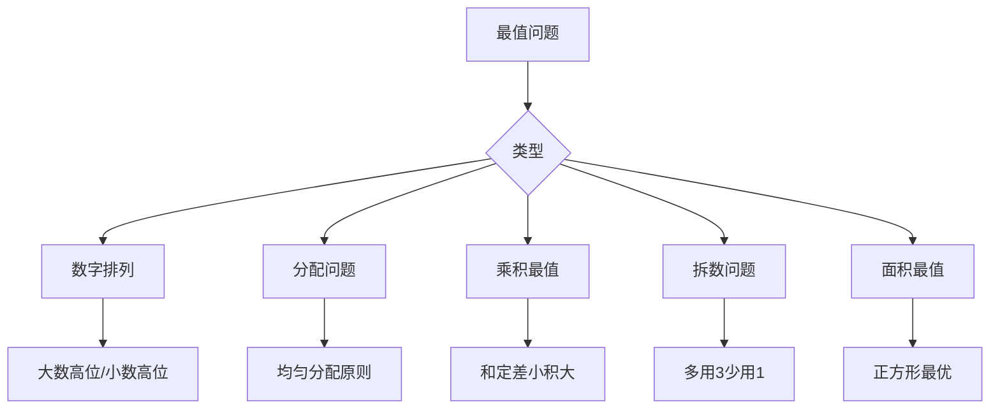

---
tags:
  - 奥数
  - 组合
  - 最值
  - 构造
lecture: 4
topic: 深思熟虑
---

# 第4讲 深思熟虑（最值与构造）

## 核心知识点

### 1. 数字组合求最值

#### 和的最值

> [!tip] 原则
> - **和最大**：大数字放高位（十位），小数字放低位（个位）
> - **和最小**：小数字放高位，大数字放低位

#### 差的最值

> [!tip] 原则
> - **差最大**：被减数尽量大，减数尽量小
> - **差最小**：两数尽量接近

#### 积的最值

> [!tip] 补零法
> 将两位数 × 三位数转化为三位数 × 三位数比较：
> - **积最大**：两数尽量接近（和一定，差小积大）
> - **积最小**：两数尽量远离（和一定，差大积小）

### 2. 删数问题

从多位数中划去若干数字，使剩余数字（顺序不变）组成的数最大/最小。

> [!tip] 贪心策略
> - **求最大**：从高位开始，保留尽可能大的数字
> - **求最小**：从高位开始，保留尽可能小的数字（首位不为0）

### 3. 插数问题

在数字间插入相同数字，使结果最大/最小。

> [!tip] 方法
> - **最大**：在第一个"前大后小"的位置重复前面的数字
> - **最小**：在第一个"前小后大"的位置重复前面的数字

### 4. 分配问题中的最值

#### 最大数最小化

> [!tip] 均匀分配原则
> 要使最大值尽量小 → 让所有数尽量**平均**（接近均值）

#### 最小数最大化

> [!tip] 同理
> 要使最小值尽量大 → 也是让所有数尽量**平均**

#### 约束条件下的分配

当要求"每人不同"时：
- 最大值最小化：取均值附近的连续整数
- 最小值最大化：同上

### 5. 和一定，差小积大

> [!important] 核心定理
> 两个正数之和固定时：
> - 两数越**接近**，乘积越**大**（相等时最大）
> - 两数越**远离**，乘积越**小**

应用：
- 长方形周长固定，正方形面积最大
- 数字组合求积的最大/最小

### 6. 围面积问题

> [!tip] 周长固定求最大面积
> - 长方形：正方形时面积最大，面积 = $(周长/4)^2$
> - 靠墙围：设篱笆长 $L$，靠墙一边不用围
>   - 最大面积 = $L^2/8$（宽 = $L/4$，长 = $L/2$）

### 7. 拆数求积最大

> [!tip] 规律
> 将正整数 $n$ 拆成若干正整数之和，使乘积最大：
> - 不用 1（1 不贡献乘积）
> - 尽量多用 3（$3 > e ≈ 2.718$ 最接近）
> - 余 1 时：拆一个 3 变成 $2+2$（因为 $2×2 > 3×1$）
> - 余 2 时：保留一个 2

### 8. 数字和为定值的最值

- **数最小**：位数尽量少，高位尽量大（用9填满）
- **数最大**：位数尽量多，每位尽量小（用1填满，但注意约束）

## 解题策略

## 经典题型

### 分苹果/分杯子

"N 个物品分给 M 人，每人不同，最多/最少的人分多少？"
- 最多的最少：从均值附近取连续整数
- 最少的最多：同上
- 盒子最多：从 1 开始累加，$1+2+\cdots+k \leq N$

### 偶数各位数字和为定值

各位数字和 = S，且为偶数：
- 最小值：个位取最小偶数，其余位用 9 填满

## 易错点

> [!warning] 注意
> - "和最大"与"积最大"策略不同！和最大要大数在高位，积最大要两数接近
> - 分配问题中"每人不同"是额外约束，不能直接平均分
> - 拆数时不要用 1，也不要用大于 4 的数（$5 = 2+3$，$2×3 > 5$）
> - 靠墙围的面积公式与普通围不同

## 相关链接

- [[第1讲 方田探秘]]
- [[第5讲 几何计数进阶]]
