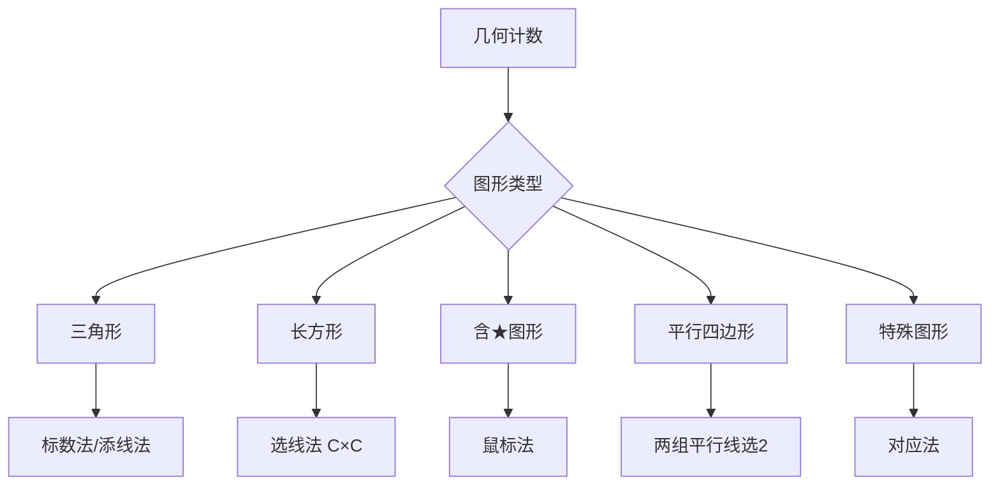

---
tags:
  - 奥数
  - 组合
  - 计数
  - 几何
lecture: 5
topic: 几何计数进阶
---

# 第5讲 几何计数进阶

## 核心知识点

### 1. 三角形计数

#### 标数法（基本三角形编号）

将图形分成最小的基本三角形，编号后按包含的基本三角形个数分类计数。

> [!tip] 步骤
> 1. 标出所有基本（最小）三角形
> 2. 按包含 1 个、2 个、3 个……基本三角形分类
> 3. 逐类枚举，求和

#### 添线法

> [!tip] 方法
> 在图中添加辅助线，利用新增的交点来计数新增的三角形。
> 
> 总数 = 原有三角形 + 添线后新增的三角形

### 2. 长方形（含正方形）计数

#### 线段选取法

> [!important] 核心公式
> 在 $m \times n$ 的网格中：
> - 长方形总数 = $C_{m+1}^2 \times C_{n+1}^2$
> - 即：横向选 2 条线 × 纵向选 2 条线

其中 $C_n^2 = \frac{n(n-1)}{2}$

#### 正方形计数

在 $n \times n$ 的网格中：
- **正放正方形**：边长 $k$ 的有 $(n-k+1)^2$ 个，$k = 1, 2, \ldots, n$
- **斜放正方形**：面积为 $a^2 + b^2$（$a, b$ 为整数），需单独枚举

### 3. 包含特定元素的计数

#### 鼠标法（包含★的长方形）

> [!tip] 鼠标法
> 包含★的长方形个数 = ★左上方格点数 × ★右下方格点数

具体地：
- 左上方格点数 = ★左边列数（含自身列）× ★上方行数（含自身行）
- 右下方格点数 = ★右边列数（含自身列）× ★下方行数（含自身行）

#### 不包含★的计数

> [!tip] 补集法
> 不含★的长方形 = 总长方形数 − 含★的长方形数

#### 包含多个★

- 同时包含所有★：找能框住所有★的最小矩形，计算该矩形的左上/右下格点数
- 只包含一个★：容斥原理 = 含A的 + 含B的 − 同时含AB的

### 4. 平行四边形计数

> [!tip] 方法
> 在两组平行线中：
> - 从第一组选 2 条：$C_m^2$ 种
> - 从第二组选 2 条：$C_n^2$ 种
> - 平行四边形总数 = $C_m^2 \times C_n^2$

### 5. 点阵中的三角形

> [!tip] 方法
> 从 $n$ 个点中选 3 个组成三角形：
> - 总选法 = $C_n^3$
> - 减去三点共线的情况
> - 三角形数 = $C_n^3$ − 共线三点组数

### 6. L形/T形等特殊图形计数

> [!tip] 对应法
> 将特殊图形与某个标准图形建立对应关系：
> - 每个 L 形对应一个 2×2 的正方形区域
> - 在每个区域内数特殊图形的个数
> - 总数 = 区域数 × 每区域内个数

### 7. 缺线/缺格的计数

当网格中有线段被擦去时：

> [!tip] 方法
> 总数 = 完整网格的图形数 − 被破坏的图形数

被破坏的图形 = 必须经过被擦去线段的图形。

## 解题策略

## 常用公式速查

| 图形 | 网格 | 公式 |
|------|------|------|
| 长方形（含正方形） | $m \times n$ | $C_{m+1}^2 \times C_{n+1}^2$ |
| 正方形（正放） | $n \times n$ | $\sum_{k=1}^n (n-k+1)^2$ |
| 三角形（点阵） | $n$ 个点 | $C_n^3$ − 共线组数 |
| 线段 | 直线上 $n$ 个点 | $C_n^2 = \frac{n(n-1)}{2}$ |

## 经典题型

### 五角星中的三角形

五边形内部被分成若干块，按块数分类：
- 1 块、2 块、3 块……逐类枚举

### 包含多个★的长方形

1. 找到包含所有★的最小矩形范围
2. 该矩形左上角可选位置数 × 右下角可选位置数

### 钉子板上的面积

在点阵上围出特定面积的三角形：
- 按底和高分类（面积 = 底 × 高 ÷ 2）
- 注意斜边情况

## 易错点

> [!warning] 注意
> - 正方形也是长方形！题目问"长方形"时要包含正方形
> - 鼠标法中格点数包含边界上的点
> - 斜放正方形容易遗漏
> - "可旋转可翻转"意味着同一形状的不同方向都要数
> - 共线判断：半圆上的点不共线（除了直径上的点）

## 相关链接

- [[第1讲 方田探秘]]
- [[第4讲 深思熟虑]]
