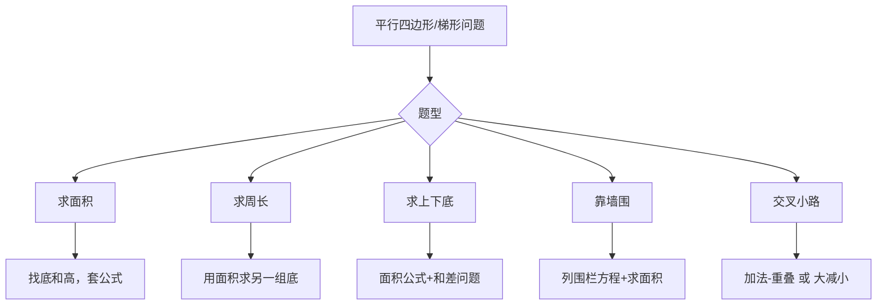

---
tags:
  - 奥数
  - 几何
  - 面积
lecture: 6
topic: 平行四边形与梯形
---

# 第6讲 平行四边形与梯形

## 核心知识点

### 1. 平行四边形面积

> [!tip] 公式
> 面积 = 底 × 高

注意：
- 平行四边形有**两组底和高**，任选一组计算
- 高必须是底边上的高（垂直距离），不是斜边

### 2. 平行四边形周长

> [!tip] 公式
> 周长 = (底1 + 底2) × 2

利用面积可以求另一组底：已知一组底×高 = 面积，可求另一组底。

### 3. 梯形面积

> [!tip] 公式
> 面积 = (上底 + 下底) × 高 ÷ 2

### 4. 梯形的和差问题

> [!example] 典型题
> 已知梯形面积、高、上下底之差，求上底和下底。
> 1. 由面积公式求出：上底 + 下底 = 面积 × 2 ÷ 高
> 2. 已知：上底 − 下底 = 差（或反过来）
> 3. 和差问题：大数 = (和 + 差) ÷ 2，小数 = (和 − 差) ÷ 2

### 5. 靠墙围图形

> [!tip] 方法
> 靠墙一边不用围栏，列出围栏总长方程，再求面积。
> - 梯形靠墙：围栏 = 上底 + 下底 + 斜边（靠墙的一边不算）
> - 长方形靠墙：围栏 = 长 + 2×宽（或 2×长 + 宽）

### 6. 交叉小路面积

> [!tip] 方法
> 两条交叉小路的面积 = 横路面积 + 竖路面积 − 重叠部分面积
> 或者：大长方形面积 − 四个角的小长方形面积

### 7. 高与斜边的关系

> [!warning] 易错点
> 平行四边形的高 < 对应的斜边（直角三角形中斜边 > 直角边）。
> 当给出一条高和两条邻边时，要判断这条高对应的是哪条底。

## 解题策略

## 易错点

> [!warning] 注意
> - 高对应哪条底要判断清楚（高 < 斜边）
> - 梯形面积别忘了 **÷2**
> - 靠墙围时要分清哪条边靠墙
> - 交叉小路别忘了减去重叠的正方形

## 相关链接

- [[小测 第6讲 平行四边形与梯形]] — 课后小测题目
- [[加油站 第6讲 平行四边形与梯形]] — 加油站练习
- [[错题 第6讲 平行四边形与梯形]] — 错题记录
- [[第1讲 方田探秘]] — 面积基础
