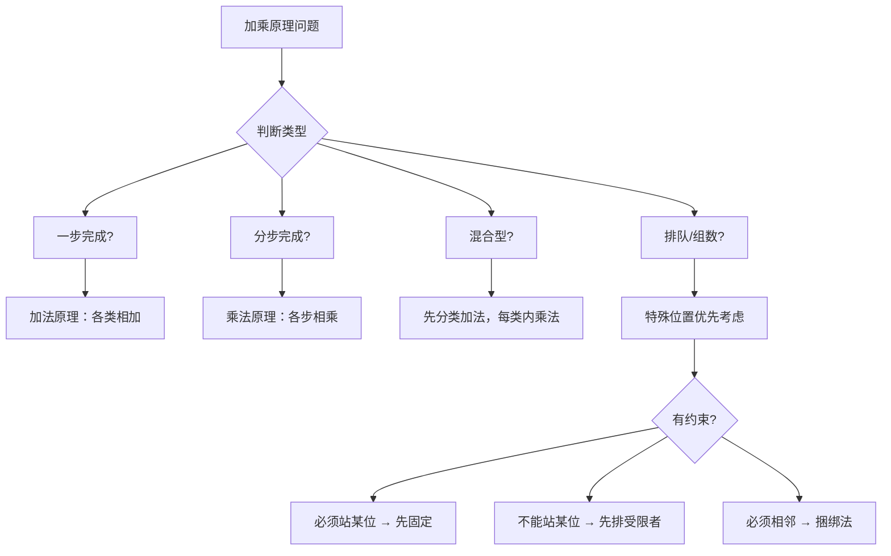

---
tags:
  - 奥数
  - 组合
  - 计数
lecture: 7
topic: 加乘原理初步
---

# 第7讲 加乘原理初步

## 核心知识点

### 1. 加法原理

> [!tip] 一步完成用加法
> 完成一件事有**多类方法**，每类方法独立完成，总方法数 = 各类方法数**相加**。

关键词识别：**选一种**、**去其中一家**、**任选一人**
- 例：飞机5趟 + 高铁8趟 = 13种选择
- 例：20名男生 + 18名女生选一名班长 = 38种

### 2. 乘法原理

> [!tip] 分步完成用乘法
> 完成一件事需要**多个步骤**，每步必须完成，总方法数 = 各步方法数**相乘**。

关键词识别：**搭配**、**各选一种**、**先…再…**
- 例：2种面食 × 3种粥 = 6种早餐搭配
- 例：3件上衣 × 4条裤子 × 2双鞋 = 24种穿搭

### 3. 可选可不选

> [!tip] 方法
> 把"不选"也当做一种情况，分类讨论后用加法原理合并。

- 例：5种蔬菜、3种荤菜必选，2种主食可选可不选
  - 选主食：$5 \times 3 \times 2 = 30$ 种
  - 不选主食：$5 \times 3 = 15$ 种
  - 共 $30 + 15 = 45$ 种

### 4. 加乘综合

> [!tip] 先分类（加法），每类内部分步（乘法）
> 遇到"选两种不同类"的问题，先列出所有类别组合（分类），再对每种组合用乘法。

- 例：10块水果糖、20块棒棒糖、30块奶糖，选两块不同类
  - 水+棒：$10 \times 20 = 200$
  - 水+奶：$10 \times 30 = 300$
  - 棒+奶：$20 \times 30 = 600$
  - 共 $200 + 300 + 600 = 1100$ 种

### 5. 排队问题（全排列）

> [!tip] n个人排一排
> $n \times (n-1) \times (n-2) \times \cdots \times 1$

- 3人排列：$3 \times 2 \times 1 = 6$
- 5人排列：$5 \times 4 \times 3 \times 2 \times 1 = 120$

### 6. 特殊位置/特殊人物优先

> [!tip] 方法
> 有约束条件时，**先安排受限制的人或位置**，再安排其余。

- 甲必须站中间：先固定甲，其余排列 → $1 \times 4 \times 3 \times 2 \times 1 = 24$
- 甲不站最左：先排甲（4种位置），再排其余 → $4 \times 4 \times 3 \times 2 \times 1 = 96$
- 甲只能站两边：先排甲（2种），再排其余 → $2 \times 4 \times 3 \times 2 \times 1 = 48$

### 7. 捆绑法

> [!tip] 处理"必须相邻"
> 把必须相邻的人**捆成一个整体**，先整体排列，再内部排列。

- 例：5人中2人必须相邻 → 捆绑后当4人排：$4 \times 3 \times 2 \times 1 = 24$，内部 $2 \times 1 = 2$ → 共 $24 \times 2 = 48$

### 8. 数字组数

> [!tip] 审题四要素
> 1. 有无重复（数字能否重复使用）
> 2. 有无0（0不能做首位）
> 3. 几位数
> 4. 奇偶要求（特殊位置优先考虑）

- 含0可重复组三位数：百位2种 × 十位3种 × 个位3种 = 18个
- 不含0不重复组三位奇数：**先个位**（奇数选择）→ 再其他位

### 9. 综合应用

> [!example] 常见题型
> - **信号旗**：挂1面/2面/3面分类，每类用排列，最后加法合并
> - **握手问题**：分清谁和谁握手，分类计算
> - **分配工作**：有约束的人优先安排，分类讨论

## 解题策略

## 易错点

> [!warning] 注意
> - **加法 vs 乘法**：一步完成（选一个）用加法，分步完成（每步都要）用乘法
> - **0不能做首位**：含0的数字组数，百位/千位要减1
> - **特殊位置先考虑**：组偶数先定个位，组奇数先定个位
> - **可选可不选**：分成"选"和"不选"两类，分别算再加
> - **两人约束要分类**：甲不站A且乙不站B → 按甲是否站B分类讨论

## 相关链接

- [[小测 第7讲 加乘原理初步]] — 课后小测题目
- [[加油站 第7讲 加乘原理初步]] — 加油站练习
- [[错题 第7讲 加乘原理初步]] — 错题记录
- [[第5讲 几何计数进阶]] — 计数方法基础
