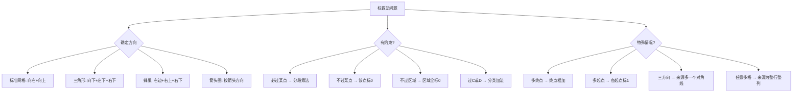

---
tags:
  - 奥数
  - 组合
  - 计数
lecture: 8
topic: 标数法
---

# 第8讲 标数法

## 核心知识点

### 1. 标数法基本步骤

> [!tip] 三步口诀
> ① **确定方向**（向右/向上，或向右/向下等）
> ② **起点标1**（同行同列也标1）
> ③ **一层一层标**（每个点 = 来源方向各点之和）

小技巧：起点同行同列都标1（因为只有一条路可达）

### 2. 基本网格最短路径

> [!tip] 标准矩形网格
> 从左下角到右上角，只能向右或向上走，用标数法逐点累加。

- 1×2 网格：3条
- 2×2 网格：6条
- 3×2 网格：10条
- L形/不规则网格：缺少的格点不参与计算

### 3. 必过某点

> [!tip] 画框分步标数
> 必须经过某点 → 分成两段：**起点→该点** 和 **该点→终点**，分别标数后用**乘法原理**相乘。

- 例：包子铺必经 → A到包子铺 × 包子铺到B = 18条
- 例：学校→市中心→养老院 = 60条
- 多个必经点按顺序分段：A→C→D→B，逐段相乘

### 4. 不过某点

> [!tip] 该点标0
> 不能经过某点 → 该点标**0**（或标×），后续计算中该点不贡献路径数。

- 例：3×3网格不过C点 → C标0，答案从20变为某个更小值
- 例：恶犬所在点标0，共7条路线

### 5. 必过某段

> [!tip] 分段标数
> 必须经过某条边（如CD段）→ 路径必须包含该段，分成 A→C→D→B 三段分别标数再相乘。

- 例：必过CD段且不过EF段 → 28条

### 6. 不过某区域

> [!tip] 区域内所有点标0
> 区域不能通行 → 区域内所有交叉点都标0，周围正常标数。

- 例：市中心附近大雨，附近路均无法通行 → 区域内全标0 → 共15条

### 7. 经过C或D（加法原理）

> [!tip] 分类讨论
> 经过C**或**D → 分成"经过C"和"经过D"两类，分别算再相加（注意去重）。

- 例：A→C→B 有735条，A→D→B 有420条，共 $735 + 420 = 1155$ 条

## 模块二：特殊图形中的标数法

### 8. 多终点/多起点

> [!tip] 多终点：终点相加
> 如果有多个终点，分别标到每个终点的路径数，最后**相加**。
> 多起点：各起点都标1。

- 例："我爱学习"树形图，4个"习"为终点 → $1+3+3+1=8$ 种
- 例："春眠不觉晓"阶梯图 → $1+4+6+4+1=16$ 种

### 9. 菱形/钻石图

> [!tip] 对称标数
> 菱形结构（如Einstein拼字）→ 从顶点向下标数，利用对称性。

- 例：Einstein → $30+30=60$ 种
- 例："飞雪迎春到" → 多起点各标1 → 共50种

### 10. 三角形网格

> [!tip] 方向可以是三个
> 三角形网格中方向可能是：向下、向左下、向右下（三个方向）。
> 来源：上、右上、左上。

- 例：三角形网格A→B → $111+41+63+41+11+1=169$ 条路

### 11. 箭头图/有向图

> [!tip] 按箭头方向标数
> 只能按箭头方向走 → 确定每个点的来源方向，逐点标数。

- 例：蚂蚁按箭头走A→B → G=1, H=2, I=3, J=4, B=5
- 例：双排箭头图 → 108种
- 例：立方体沿箭头P→Q → 12种

### 12. 蜂巢/六边形网格

> [!tip] 六边形来源
> 蜂巢中每个格子的来源是左侧邻近的格子（左边、左上、左下）。

- 例：蜜蜂回家（2行）→ 斐波那契数列 1,1,2,3,5,8,13,21,34,55… → 89种
- 例：蜜蜂回家（3行，右边/右上/右下）→ 22种
- 例：蜂巢有坏隔间标0 → 32种
- 例：蜂巢必过C绕开D → 688种

### 13. 三方向网格（含对角线）

> [!tip] 来源增加对角线
> 每步可向右、向上、向右上 → 来源为：左、下、左下。

- 例：棋子3×4格 → 63种
- 例：起点标0（左下角标0）→ 来源包含左下所有格

### 14. 皇后走法（任意多格）

> [!tip] 来源为整行/整列/整对角线
> 皇后每步可向右/向上/向右上移动**任意多格** → 每个点的来源是左边所有格 + 下面所有格 + 左下对角线所有格。

- 例：4×4棋盘皇后 → 188种

### 15. 马走日

> [!tip] 特殊跳跃规则
> 国际象棋马：横2竖1 或 横1竖2。找出所有可能的中间点，分段标数。

- 例：8×8棋盘△→☆（横3竖7）→ 分成A₁A₂A₃到B₁B₂B₃B₄的所有路径 → 12条

### 16. 圆环/花坛

> [!tip] 圆上顺时针 + 线段从小圆到大圆
> 确定方向后逐点标数。

- 例：3个圆5条线段，顺时针+从小到大 → 6种

## 解题策略

## 易错点

> [!warning] 注意
> - **方向搞反**：先确定方向再标数，方向决定了来源是哪些点
> - **不过某点忘标0**：不过的点必须标0或×，不能跳过
> - **必过某点忘用乘法**：分段后是乘法原理，不是加法
> - **多终点忘相加**：多个终点要把各终点的数相加
> - **蜂巢来源搞错**：六边形每个格子有2-3个来源，要看清方向
> - **皇后vs棋子**：棋子每步一格（来源只看相邻），皇后任意多格（来源看整行）

## 相关链接

- [[小测 第8讲 标数法]] — 课后小测题目
- [[加油站 第8讲 标数法]] — 加油站练习
- [[错题 第8讲 标数法]] — 错题记录
- [[第5讲 几何计数进阶]] — 计数方法基础
- [[第7讲 加乘原理初步]] — 加乘原理（标数法中常用乘法原理）
