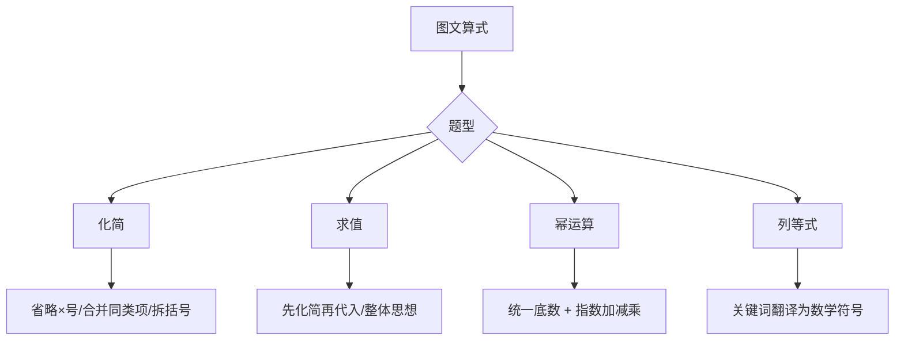

---
tags:
  - 奥数
  - 组合
  - 章法
lecture: 9
topic: 图文算式
---

# 第9讲 图文算式（字母表示数）

## 模块一：字母表示和化简

### 1. 字母×数的化简

> [!tip] 四条规则
> 1. **直接省略"×"**：$7 \times m = 7m$
> 2. **特殊的"1"**：$1 \times a = a$（1可省略不写）
> 3. **数在前，字母在后**：$a \times 9 = 9a$，$y \times 8 = 8y$
> 4. **带计算的先算数**：$4 \times 5b = 20b$，$2 \times 7a \times 5 = 70a$

### 2. 字母×字母的化简

> [!tip] 规则
> 1. **省略"×"，按字母表顺序排好**：$m \times n = mn$，$m \times n \times a \times b = abmn$
> 2. **带计算的先算数**：$4 \times a \times 5 \times b = 20ab$
> 3. **相同字母相乘写成乘方**：$a \times a = a^2$，$b \times b \times b = b^3$

### 3. 幂的概念

> [!tip] 乘方的定义
> 求 $n$ 个相同因数的积的运算叫**乘方**：
> $$\underbrace{a \times a \times a \times \cdots \times a}_{n \text{个} a} = a^n$$
> - $a$ 叫做**底数**，$n$ 叫做**指数**，$a^n$ 叫做**幂**
> - 读作"$a$ 的 $n$ 次方"或"$a$ 的 $n$ 次幂"

**常见计算**：$2^5 = 32$，$3^4 = 81$，$4^3 = 64$

### 4. 合并同类项

> [!tip] "不是一家人，不进一家门"
> - 相同字母的项可以合并：$3a + 5a = 8a$，$7b - b = 6b$
> - 不同字母不能合并：$a + 2b + 8a = 9a + 2b$
> - 注意区分加法和乘法：$2a \times 4 = 8a$（乘法），$a \times a \times a + a \times a = a^3 + a^2$（不同次幂不合并）

**典型判断**：
- $b + b = b^2$？❌ 应为 $2b$
- $a + a + a = a^3$？❌ 应为 $3a$
- $a \times a \times b = 2ab$？❌ 应为 $a^2b$
- $4 \times 3 \times a = 43a$？❌ 应为 $12a$

### 5. 带括号的化简（乘法分配律）

> [!tip] "警察抓小偷"：括号外的数分别乘括号内每一项
> - $(a+b) \times c = ac + bc$
> - $(a-b) \times c = ac - bc$

**去括号规则**：
- **加号+( )**：直接去括号，符号不变
- **减号-( )**：去括号后，里面每项变号

**例**：
- $9 \times (m+n) = 9m + 9n$
- $a \times (2+b) = 2a + ab$
- $15a - 7(a+4) = 15a - 7a - 28 = 8a - 28$

### 6. 双括号相乘

> [!tip] 把第二个括号拆开，分别乘第一个括号
> $(a+b) \times (c+d) = ac + ad + bc + bd$

**例**：
- $(a+3) \times (2+b) = 2a + ab + 6 + 3b$
- $(3m-n) \times (m+2n) = 3m^2 - mn + 6mn - 2n^2 = 3m^2 + 5mn - 2n^2$

---

## 模块二：代数式求值

### 1. 直接代入

> [!tip] 把字母的值代入算式中计算
> 如果 $a=5$，$b=1$，$A=a+b$，$B=ab$，则 $A+B = 6+5 = 11$

### 2. 先化简再代入

> [!tip] 代入前先把式子化简到最简，能大幅减少计算量
> 若化简后变量项抵消，答案与变量无关。

**例**：$A = 11(x+3)-7 = 11x+26$，$B = 21+21x-8(15+2x) \div 4$... 化简后 $A-B+C = 22$（常数，与 $x=2105$ 无关）

### 3. 整体思想

> [!tip] 不求每个字母的具体值，把已知条件当作整体代入
> - 已知 $2a+b=4$，求 $13+6a+3b$：注意 $6a+3b = 3(2a+b) = 12$，所以答案 $= 25$
> - 已知 $a \div b = 5$，求 $(a \div 2) \div (b \div 4) = a \div b \times 4 \div 2 = 10$

### 4. 用含字母的算式表示关系

> [!tip] 关键词翻译
> - "是"、"比" → 用 "=" 替换
> - "共"、"和" → 用 "+" 连接
> - "比…多/少" → 加/减
> - "…的几倍" → 乘

**例**：
- 比 $A$ 的4倍多3：$4A+3$
- 猪八戒有 $a$ 个人参果的3倍多5个：$3a+5$
- 长方形长 $2a+b$，宽比长小 $a-b$，周长 $= 6a+6b$

---

## 模块三：幂的运算

### 1. 同底数幂相乘：底数不变，指数相加

$$a^m \times a^n = a^{m+n}$$

- $3^2 \times 3^4 = 3^6$
- $5^2 \times 5^7 = 5^9$
- 注意：$3^4 \times 4^3 \neq 7^7$（底数必须相同！）

### 2. 同底数幂相除：底数不变，指数相减

$$a^m \div a^n = a^{m-n} \quad (m \geq n)$$

- $7^{20} \div 7^7 = 7^{13}$
- $a^{10} \div a^{10} = a^0 = 1$（除0外，任何数的0次方等于1）

### 3. 幂的乘方：底数不变，指数相乘

$$(a^m)^n = a^{m \times n}$$

- $(5^6)^2 = 5^{12}$
- $(5^6)^{10} = 5^{60}$

### 4. 积的乘方 = 乘方的积

$$(a \times b)^m = a^m \times b^m$$

- $(5^6 \times 4^7)^3 = 5^{18} \times 4^{21}$
- $(3 \times 7)^5 = 3^5 \times 7^5$

### 5. 综合应用

**统一底数法**：把所有数转化为同一底数，再利用指数运算。

- 已知 $2^m \times 4^3 \times 8^4 \times 16^m = 2^{38}$
  - $= 2^m \times 2^6 \times 2^{12} \times 2^{4m} = 2^{5m+18} = 2^{38}$
  - 所以 $m = 4$

**整体代换**：
- 已知 $2^m = 7$，$2^n = 3$，则 $2^{m+2n} = 2^m \times (2^n)^2 = 7 \times 9 = 63$
- 已知 $5^m = 6$，$5^n = 3$，则 $5^{3m-2n} = (5^m)^3 \div (5^n)^2 = 216 \div 9 = 24$

**比较大小**：
- $81^{31}$ vs $27^{41}$ vs $9^{61}$：统一为3的幂
  - $81^{31} = 3^{124}$，$27^{41} = 3^{123}$，$9^{61} = 3^{122}$
  - 所以 $81^{31} > 27^{41} > 9^{61}$

---

## 解题策略

## 易错点

> [!warning] 特别注意
> - **$a \times 2 \neq a2$**：应为 $2a$（数在前字母在后）
> - **$b + b \neq b^2$**：$b+b = 2b$，$b \times b = b^2$
> - **$a + a + a \neq a^3$**：$a+a+a = 3a$，$a \times a \times a = a^3$
> - **$6 \times 6 \neq 66$**：$6 \times 6 = 36$
> - **去括号前是减号时里面变号**：$a-(b-c) = a-b+c$
> - **幂运算底数必须相同**才能用法则

---

## 补充模块：拓展题精选

### 完全平方公式

$(a+b)^2 = a^2 + 2ab + b^2$，$(a-b)^2 = a^2 - 2ab + b^2$

- $(2x-3)^2 = 4x^2 - 12x + 9$

### 高次求值（递推法）

已知 $a+b$ 和 $a^2+b^2$，可逐步求：
- $ab = \frac{(a+b)^2 - (a^2+b^2)}{2}$
- $a^3 + b^3 = (a+b)(a^2+b^2-ab)$

---

## 相关链接

- [[小测 第9讲 图文算式]]
- [[加油站 第9讲 图文算式]]
- [[错题 第9讲 图文算式]]
