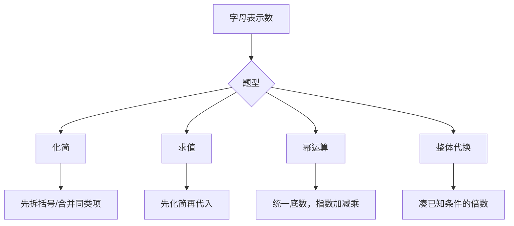

---
tags:
  - 奥数
  - 代数
  - 字母表示数
lecture: 9
topic: 字母表示数
---

# 第9讲 字母表示数

## 核心知识点

### 1. 乘方的意义

> [!tip] $a^n$ 表示 n 个 a 相乘
> - $10^9$ = 9个10相乘
> - $11^6$ = 6个11相乘
> - $6^3 = 6 \times 6 \times 6 = 216$（底数6，指数3）

### 2. 字母式化简规则

> [!tip] 四条规则
> 1. **数字放字母前面**：$a \times 5 = 5a$
> 2. **字母连乘按字母表顺序**：$n \times m = mn$，$a \times b \times x = abx$
> 3. **合并同类项**：$a + a + a = 3a$
> 4. **同字母相乘用乘方**：$a \times a = a^2$，$b \times b = b^2$

### 3. 拆括号（乘法分配律）

> [!tip] 括号外 × 括号内每一项
> - $3(a + 2b) = 3a + 6b$
> - $(a + 5) \times 4 = 4a + 20$
> - $(2a + 3) \times 2 = 4a + 6$
> - $(x+2)(y+4) = xy + 4x + 2y + 8$（每项都乘）

### 4. 完全平方公式

> [!tip] $(a+b)^2 = a^2 + 2ab + b^2$
> - $(a + 5b)^2 = a^2 + 10ab + 25b^2$
> - $(3x + 2y)^2 = 9x^2 + 12xy + 4y^2$

### 5. 代入求值

> [!tip] 先化简，再代入
> 先把式子化简成最简形式，再代入数值计算，可以避免大量运算。

- 例：$A = 11(x+3)-7 = 11x+26$，当$x=10$时 $A = 136$
- 技巧：如果化简后常数项抵消（与x无关），则无论x取何值结果相同

### 6. 幂的运算

> [!tip] 三条法则
> - **同底数幂相乘**：$a^m \times a^n = a^{m+n}$
> - **幂的乘方**：$(a^m)^n = a^{mn}$
> - **同底数幂相除**：$a^m \div a^n = a^{m-n}$
> - **积的乘方**：$(ab)^n = a^n \cdot b^n$

- 例：$7^2 \times 7^4 \times 7^8 \times 7^{16} = 7^{30}$
- 例：$(a^2b)^6 \div (ab)^5 = a^{12}b^6 \div a^5b^5 = a^7b$

### 7. 整体代换

> [!tip] 用已知条件凑目标式
> 看到目标式中能整体替换为已知条件的部分，直接代入。

- 例：已知$13a - 4b = 11$，求$2013 - (20b - 65a) = 2013 + 5(13a-4b) = 2013 + 55 = 2068$
- 例：已知$2^m = a$，$2^n = b$，则$2^{m+2n} = 2^m \times (2^n)^2 = ab^2$

### 8. 高次求值（递推法）

> [!tip] 用低次结果递推高次
> 已知$a+b$和$a^2+b^2$，可逐步求$ab$、$a^3+b^3$、$a^4+b^4$等。

- $ab = \frac{(a+b)^2 - (a^2+b^2)}{2}$
- $a^3 + b^3 = (a+b)(a^2+b^2-ab)$
- $a^4 + b^4 = (a^2+b^2)^2 - 2(ab)^2$

## 解题策略

## 易错点

> [!warning] 注意
> - **$4^2 \neq 4 \times 2$**：$4^2 = 4 \times 4 = 16$，不是$4 \times 2 = 8$
> - **$c \times 2 \neq c^2$**：$c \times 2 = 2c$，而$c^2 = c \times c$
> - **$5 + x \neq 5x$**：加法不能化简成乘法
> - **$a \times b \times 3 = 3ab$**，不是$ab^3$
> - **拆括号别漏项**：$(x+2)(y+4)$有4项，不是2项

## 相关链接

- [[错题 第9讲 字母表示数]] — 错题记录
- [[第7讲 加乘原理初步]] — 乘法原理基础
